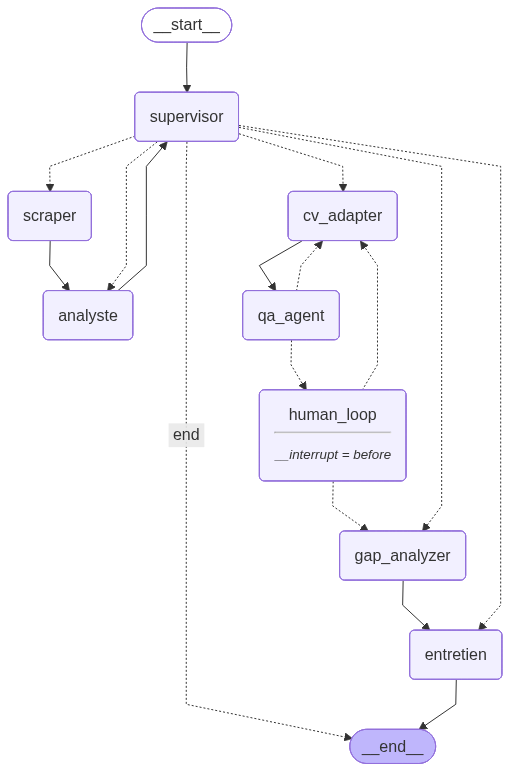

# CareerAgent — Système Multi-Agent Intelligent

> **Trouve ton stage · Adapte ton CV · Prépare ton entretien**
> Projet de Fin de Module — Master SDIA · ENSET Mohammedia · 2025-2026

---

## Équipe

| Membre |
|--------|
| **EL JIRARI Houda** |
| **EL BARNAOUI Maroua** |

**Encadrante :** Prof. RETAL Sara — Module Systèmes Multi-Agents et Intelligence Artificielle Distribuée

---

## Présentation

**CareerAgent** est un écosystème multi-agent intelligent conçu pour accompagner les étudiants en Master IA dans leur recherche de stage. Le système orchestre **7 agents spécialisés** via **LangGraph**, intègre un **RAG agentique** basé sur ChromaDB, un mécanisme **Human-in-the-Loop**, une évaluation des prompts par **test A/B**, et une interface web interactive développée avec **Streamlit**.

### Ce que fait CareerAgent

| Étape | Agent | Action |
|-------|-------|--------|
| 1 | **Scraper** | Collecte 15 offres réalistes filtrées par domaine (Maroc, 2025) |
| 2 | **Analyste RAG** | Classe les offres via RAG itératif 2 requêtes — scoring CV/offre |
| 3 | **CV Adapter** | Adapte le CV avec Prompt B optimisé ATS |
| 4 | **QA Agent** | Valide le CV via 5 tests automatisés (ATS, Hallucination, Format...) |
| 5 | **Human-in-the-Loop** | Interruption LangGraph — validation ou refus avec feedback |
| 6 | **Gap Analyzer** | Identifie les compétences manquantes + plan 30/60/90 jours |
| 7 | **Entretien Prep** | Génère 5 questions ciblées (technique + comportemental + motivation) |

---

## Workflow Agentique



*Diagramme généré automatiquement depuis le graphe LangGraph compilé*

---

## Architecture

```
CareerAgent-multi-agent-system/
├── graph.py                  ← Orchestrateur LangGraph principal
├── agents/
│   ├── analyste.py           ← Agent RAG itératif (Maroua)
│   ├── qa_agent.py           ← Agent QA — 5 tests (Maroua)
│   ├── scraper.py            ← Agent Scraper — 15 offres (Houda)
│   ├── cv_adapter.py         ← Agent CV Adapter Prompt B (Houda)
│   ├── gap_analyzer.py       ← Agent Gap Analyzer (Houda)
│   └── entretien.py          ← Agent Entretien Prep (Houda)
├── rag/
│   └── vector_store.py       ← ChromaDB + embeddings + seed
├── tools/
│   └── prompt_evaluation.py  ← Test A/B Prompt A vs Prompt B
├── ui/
│   └── app.py                ← Interface Streamlit 5 étapes
├── data/knowledge_base/      ← Documents RAG
├── chroma_db/                ← Base vectorielle persistée
├── .env                      ← Variables d'environnement (non versionné)
├── pyproject.toml            ← Dépendances uv
└── README.md
```

### Flux LangGraph

```
[Supervisor] → [Scraper] → [Analyste RAG] → [Supervisor]
                                                  ↓
                                          [CV Adapter] ← feedback
                                                  ↓
                                           [QA Agent]
                                         ↙           ↘
                                     PASS            FAIL (retry x3)
                                       ↓
                              ⏸ [Human Loop]
                             ↙             ↘
                         Validé          Refusé + feedback
                           ↓
                   [Gap Analyzer] → [Entretien] → END
```

---

## Installation

### Prérequis

- Python 3.10+
- [uv](https://astral.sh/uv) (recommandé) ou pip
- Git

### Étapes

```bash
# 1. Cloner le repo
git clone https://github.com/houda-eljirari/CareerAgent-multi-agent-system.git
cd CareerAgent-multi-agent-system

# 2. Créer l'environnement virtuel
uv venv
source .venv/bin/activate        # Linux/Mac
.venv\Scripts\activate           # Windows

# 3. Installer les dépendances
uv pip install -r requirements.txt

# 4. Configurer les variables d'environnement
# Créer un fichier .env à la racine :
# ANTHROPIC_API_KEY=sk-ant-...  (optionnel — fallback local si absent)

# 5. Initialiser la base ChromaDB
python -c "from rag.vector_store import seed_knowledge_base; seed_knowledge_base()"

# 6. Lancer l'application
streamlit run ui/app.py
```

---

## Utilisation

### Interface Web

```bash
streamlit run ui/app.py
# → http://localhost:8501
```

**5 étapes dans l'interface :**

| Étape | Description |
|-------|-------------|
| **Profil** | Upload CV PDF (pdfplumber) ou saisie manuelle + choix du domaine |
| **Offres** | 10 offres analysées et classées par score ATS (32/100 à 76/100) |
| **Adaptation** | Agent CV Adapter + Agent QA — Prompt B optimisé ATS |
| **Validation** | Human-in-the-Loop — Valider ou Refuser avec feedback |
| **Résultats** | Gaps + plan 30/60/90j + 5 questions d'entretien + téléchargement CV |

### Test A/B des Prompts

```bash
python tools/prompt_evaluation.py
```

---

## Les 7 Agents

| Agent | Fichier | Rôle | Mode |
|-------|---------|------|------|
| **Supervisor** | `graph.py` | Routing conditionnel — chef d'orchestre | Toujours actif |
| **Scraper** | `agents/scraper.py` | 15 offres filtrées par domaine (Maroc 2025) | Local |
| **Analyste** | `agents/analyste.py` | RAG itératif 2 requêtes — scoring CV/offre | ChromaDB |
| **CV Adapter** | `agents/cv_adapter.py` | Adaptation ATS avec Prompt B | LLM / Fallback |
| **QA Agent** | `agents/qa_agent.py` | 5 tests automatisés sur le CV adapté | Local |
| **Gap Analyzer** | `agents/gap_analyzer.py` | Compétences manquantes + plan 30/60/90j | LLM / Fallback |
| **Entretien** | `agents/entretien.py` | 5 questions ciblées par type | LLM / Fallback |

---

## Évaluation des Prompts — Test A/B

| Cas | Offre | Prompt A | Prompt B | Gain | Hallucinations |
|-----|-------|----------|----------|------|----------------|
| 1 | Stage Data Scientist | 40/100 | 45/100 | +5 | 0 / 0 |
| 2 | Stage QA Engineer | 40/100 | 45/100 | +5 | 0 / 0 |
| 3 | Stage ML Engineer | 80/100 | 85/100 | +5 | 0 / 0 |
| 4 | Stage IA Developer | 80/100 | 85/100 | +5 | 0 / 0 |
| 5 | Stage Data Analyst | 60/100 | 65/100 | +5 | 0 / 0 |
| **Moyenne** | | **60/100** | **65/100** | **+5** | **0 / 0** |

> Prompt B surpasse Prompt A sur tous les cas · Zéro hallucination · Retenu comme version de production

---

## Stack Technologique

| Technologie | Usage |
|-------------|-------|
| **Python 3.12** | Langage principal |
| **LangGraph** | Orchestration multi-agent + checkpoints + interrupt |
| **ChromaDB** | Base vectorielle RAG persistante |
| **ONNX MiniLM-L6-v2** | Embeddings locaux sans API |
| **Streamlit** | Interface web interactive 5 étapes |
| **pdfplumber** | Extraction texte depuis CV PDF |
| **python-dotenv** | Gestion variables d'environnement |
| **uv** | Gestionnaire de paquets rapide |
| **Claude Haiku** (optionnel) | LLM pour adaptation CV et questions |

---

## Checklist Projet

- [x] `graph.py` — StateGraph LangGraph avec routing conditionnel
- [x] Agent Supervisor + 3 routeurs conditionnels
- [x] Agent Analyste — RAG itératif 2 requêtes par offre
- [x] Agent QA — 5 tests automatisés (seuil 70/100)
- [x] Human-in-the-Loop — interrupt_before + update_state
- [x] Test A/B — 5 cas, tableau comparatif, zéro hallucination
- [x] Agent Scraper — 15 offres structurées (Maroc 2025)
- [x] Agent CV Adapter — Prompt B ATS + fallback local
- [x] Base ChromaDB — seed 5 docs + add_cv_to_rag()
- [x] Agent Gap Analyzer — plan 30/60/90j + 30 ressources
- [x] Agent Entretien Prep — 5 questions (24 compétences tech)
- [x] Interface Streamlit — 5 étapes avec upload PDF
- [x] Workflow diagram — généré automatiquement via LangGraph
- [x] Tests end-to-end avec vrai CV PDF (scores 32/100 → 76/100)

---

Projet académique — Master SDIA · ENSET Mohammedia · 2025-2026
Module : Systèmes Multi-Agents et Intelligence Artificielle Distribuée
Encadrante : Prof. RETAL Sara
